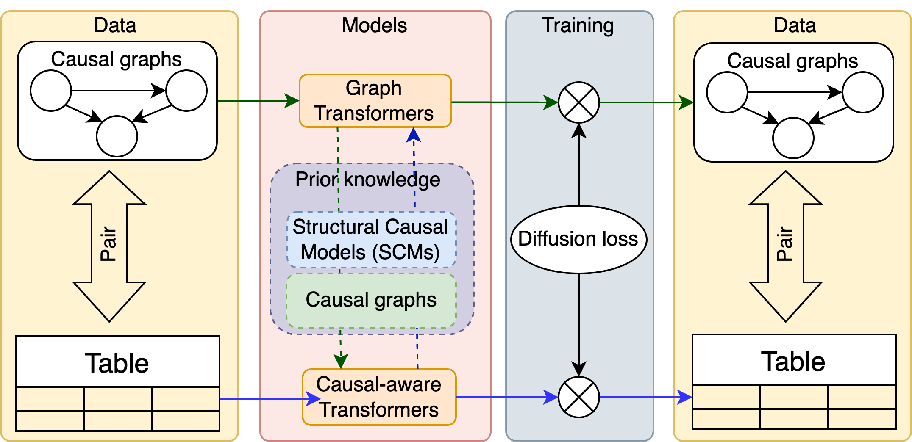

# Introduction
Tabular foundation models are ...





# Citation
> Tu, Ruibo. (Sep. 2024). Tabular Foundation Models. Ruibo-blog. https://turuibo.github.io/posts/2024-09-11-tabular-foundation-models/.

or

```
@article{tu2024tabularllms,
  title   = "Tabular Foundation Models",
  author  = "Tu, Ruibo",
  journal = "turuibo.github.io",
  year    = "2024",
  month   = "Sep",
  url     = "https://turuibo.github.io/posts/2024-09-11-tabular-foundation-models/"
}

```